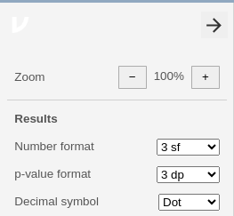

# (PART) Using jamovi {-}


# jamovi: general information {#jamoviGeneral}


```{block2, type="rmdobjectives"}
In this chapter, you will learn:

* tips for working with jamovi.

```


## About jamovi

* jamovi is a relatively **new** package (built on **R** [@Software:Rsoftware], which is very solid and reliable, and has been available since 1993).
*	jamovi is **free** to download, from [the jamovi webpage](https://www.jamovi.org/); avoid the Cloud version.
*	*Except for graphs*, jamovi output should **not** be presented in reports or presentations.
  Instead, the information from jamovi output should be used to construct proper tables (e.g., rounded numbers; units of measurement; decimal points aligned; etc.). 
* The number of displayed decimal places (`dp`) or significant figures(`sf`) can be adjusted using the three vertical dots in the top right corner.

```{r jamoviThreeDots, echo=FALSE, fig.cap="Left: Click on the three dots to set the number of decimal places or significant figures shown. Right: The default settings", fig.align="center", out.width=c("25%", "10%", "40%"), fig.show='hold', fig.sep='\\hspace{2cm}',}
knitr::include_graphics( "jamoviImages/ThreeDots.png" )
knitr::include_graphics( "images/SPACER.png" )

```


## Further help

You can get help with using jamovi by:

- Watching software screencasts on Canvas.
- Using [jamovi resources](https://www.jamovi.org/user-manual.html).
- Using [LinkedIn Learning](https://www.linkedin.com/learning/).
- Watching [videos](https://datalab.cc/tools/jamovi).
- Asking SCI110 staff **in tutorials**, or in the Canvas *Discussions*.


