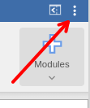
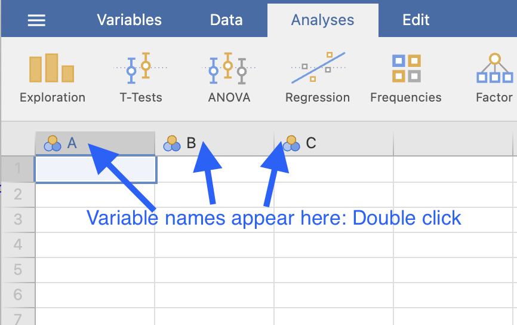
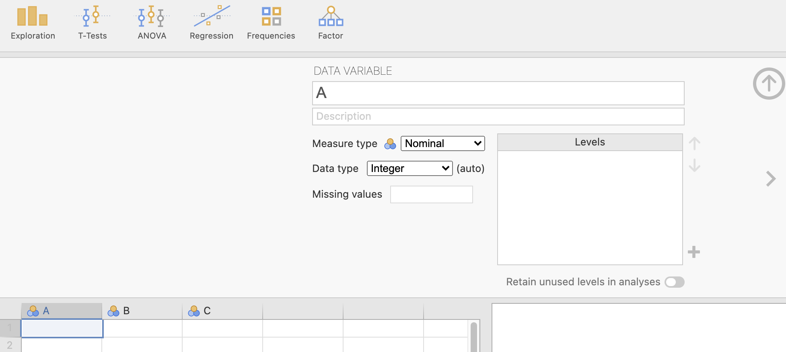

# (PART) Using jamovi {-}


# jamovi: general information {#jamoviGeneral}


```{block2, type="rmdobjectives"}
**Topics** covered in this chapter:

* Tips for working with jamovi.

```


## About jamovi

* jamovi is a very **new** package (built on **R** [@Software:Rsoftware], which is very solid and reliable).
*	jamovi is **free** to download, from [the jamovi webpage](https://www.jamovi.org/).
*	*Except for graphs*, jamovi output should **not** be presented in reports or presentations.  
  Instead, the information from jamovi output should be used to construct proper tables, or to produce proper conclusions. 
* The number of displayed decimal places (`dp`) or significant figures(`sf`) can be adjusted using the three vertical dots in the top right corner.

```{r jamoviThreeDots, echo=FALSE, fig.cap="Click on the three dots to set the number of decima places or significant figures shown.", fig.align="center", out.width="20%"}

```


## Before starting an analysis

Before starting analysis with [jamovi](https://www.jamovi.org/) [@Software:jamovi], here are some **general tips**:

* The information about the variables must be correctly set up **before** analysis.
* In jamovi (as with most statistical software), *each row represents one unit of analysis*.
* In jamovi (as with most statistical software), *each column represents one variable*.
* At the top of each column (but **not** in Row\ 1!) is the *name* of the variable; *double click* on the variable name and set information about the variables there (Fig.\  \@ref(fig:jamoviVariables1)).
	Then you can tell jamovi information *about* the variables, such as whether the data are nominal, ordinal or 'continuous' (which is what jamovi calls *all* quantitative variables...), and the *levels* of the nominal and ordinal variables (Fig. \@ref(fig:jamoviVariablesSet)).


```{r jamoviVariables1, echo=FALSE, fig.cap="Click on the column headers to describe the variables.", fig.align="center", out.width="50%"}

```
   
```{r jamoviVariablesSet, echo=FALSE, fig.cap="The information to fill in for each variable.", fig.align="center", out.width="100%"}

```
   
	

## Further help

You can get help with using jamovi by:

- Watching software screencasts on Canvas.
- Using [jamovi resources](https://www.jamovi.org/user-manual.html).
- Using [LinkedIn Learning](https://www.linkedin.com/learning/).
- Watching [videos](https://datalab.cc/tools/jamovi).
- Asking SCI110 staff **in tutorials**, or in the Canvas *Discussions*.


