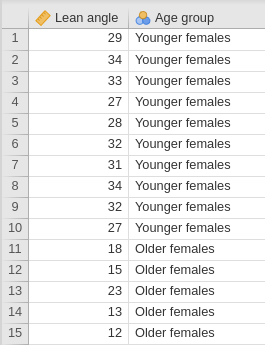
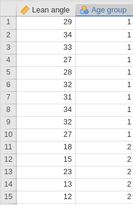
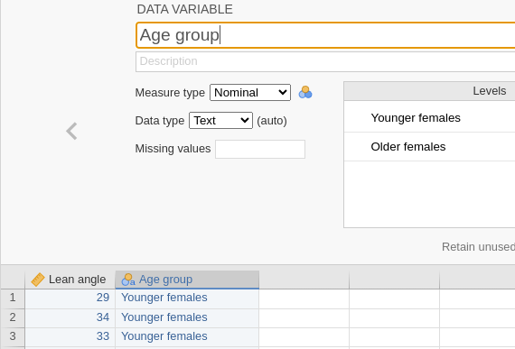
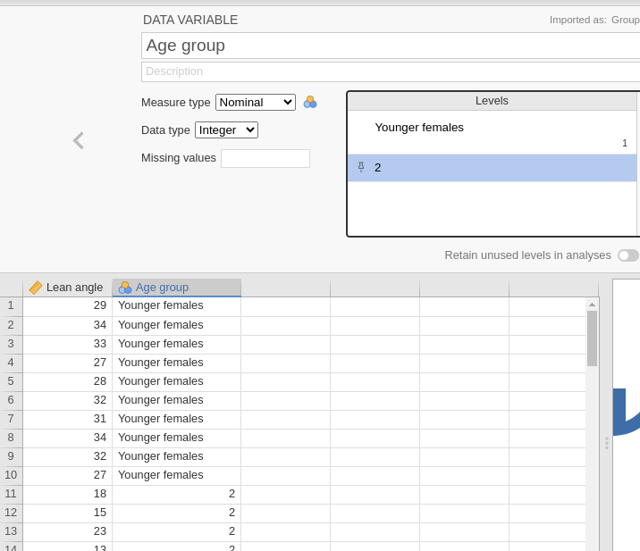
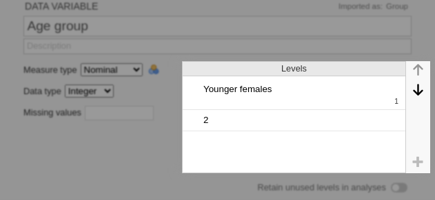

# jamovi: data set up and entry {#jamoviDataEntry}


```{block2, type="rmdobjectives"}
In this chapter, you will learn:

* how to enter data correctly into jamovi.

```


## Preparing for data entry {#DataEntryPrep}

Before entering your data into jamovi, here are some **important reminders**:

* In jamovi (as with most statistical software), *each row represents one unit of analysis*.
* In jamovi (as with most statistical software), *each column represents one variable*.


## Define the variable names {#DataEntrySetup}

At the top of each column (that is: **above**, but *not in*, Row\ 1!) is the *name* of the variable.
When you *double click* on the column headings (Fig.\ \@ref(fig:jamoviVariables1)), information *about* the variables can be set (Fig.\ \@ref(fig:jamoviVariablesSet)).

First, give the data a useful name.	
This name is what is used in plots and tables, for example.

Then you can tell jamovi information *about* the variables, such as whether the data are nominal, ordinal or 'continuous' (which is what jamovi calls *all* quantitative variables...), and the *levels* of the nominal and ordinal variables.

The information *about* the variables must be correctly set up **before** analysis.


```{r jamoviVariables1, echo=FALSE, fig.cap="Click on the column headers to describe the variables.", fig.align="center", out.width="50%"}
knitr::include_graphics( "jamoviImages/jamovi-Vars2.png" )
```
   
```{r jamoviVariablesSet, echo=FALSE, fig.cap="The information to fill in for each variable.", fig.align="center", out.width="80%"}
knitr::include_graphics( "jamoviImages/jamovi-VarSet.png" )
```
   
	
## Define the variable information {#jamoviDefineVars}

For this section, the data introduced in Sect. \@ref(jamoviLeanAngle) are used, as it demonstrates how to enter data for both *quantitative* and *qualitative* variables.

In the **Data** area, each row represents a unit of analysis (in this case, a person), as is usual in jamovi.
For these data, each unit of analysis gets two variables recorded: one is quantitative (**Lean angle (in degrees)**), and one is qualitative (**Age group**).
So there are two columns in the data, one for each variable (Fig.\ \@ref(fig:jamoviDataSetUp)).

The order of the variables in the columns doesn't matter, but here the quantitative variable is listed first (the lean- angle), and then the qualitative variable (the age group).


The variables need to be properly set up by double-clicking on the variable names, as described below.


```{r jamoviDataSetUp, echo=FALSE, fig.cap="The data entered in jamovi. Left: Using the actual names of the levels. Right: Using digits to represent the levels.", fig.align="center", out.width=c("36%", "20%", "30%"), fig.show='hold'}

knitr::include_graphics( "images/SPACER.png" )

```


### Adding information for quantitative variables {#jamoviDataEntryQuant}

After double-clicking on the column header (the variable name) for a **quant**itative variable, set the variable type as **Continuous** (which, unfortunately, is how jamovi describes *all* quantitative data).
The `Data type` can then be set as `Integer` (discrete) or `Decimal` (continuous).
Also give the variable a sensible name (Fig.\ \@ref(fig:jamoviQuantSetUp)).


```{r jamoviQuantSetUp, echo=FALSE, fig.cap="Describing the quantitative variable.", fig.align="center", out.width="60%"}
knitr::include_graphics( "jamoviImages/TwoInd/FacePlant-vars-Angle.png" )
```


### Adding information for qualitative variables {#jamoviDataEntryQual}

**Qual**itative data requires more care than for quantitative variable to set up, as the levels of the variable need to be described.
After double-clicking on the column header (the variable name) for a **qual**itative variable, set the variable type as **Nominal** or **Ordinal**  as appropriate.

The next step depends on *how* the data have been, or will be, entered into jamovi.

* If the data have been, or will be, entered by using the actual names of the levels (e.g., one level is labelled `Older females` and the other as `Younger females`) as in Fig.\ \@ref(fig:jamoviDataSetUp) (left image):
  - Set the `Data type` as `Text` (Fig.\ \@ref(fig:jamoviQualText)).
  - The data is then entered using these *exact* descriptions for the levels.

* If the data have been, or will be, entered by distinguishing the levels using digits (e.g., `1` is used for `Older females` and `2` is used for `Younger females`),  as in Fig.\ \@ref(fig:jamoviDataSetUp) (right image)
  - Set the `Data type` as `Integer`, as in Fig.\ \@ref(fig:jamoviQualInteger).
  - Then, jamovi must be told what these digits *mean*, by clicking on the individuals `Levels' (Fig.\ \@ref(fig:jamoviQualIntegerExplain)), and replacing digits by what these levels mean.
  Notice, as shown in Fig.\ \@ref(fig:jamoviQualInteger), that the integers are replaced by their *level meanings*, even though the digits remain in the data file (i.e., the data have not been changed).
  - The data is then entered using these *exact* digits for the levels.


```{r jamoviQualText, echo=FALSE, fig.cap="Describing the qualitative variable. The first level has been described using text descriptions, such as 'Younger females'.", fig.align="center", out.width="70%"}

```


```{r jamoviQualInteger, echo=FALSE, fig.cap="Describing the qualitative variable: levels are distinguished using digits.", fig.align="center", out.width="90%"}

```


```{r jamoviQualIntegerExplain, echo=FALSE, fig.cap="Describing the qualitative variable.", fig.align="center", out.width="70%"}

```

The two age groups are defined so that a `1` represents younger women, and a `2` represents older women.
In the jamovi worksheet, the values `1` and `2` were entered, but jamovi shows what these mean in the worksheet when these values are defined.


### Entering the data {#DataEntryInformation}

Once the variables have been correctly defined, the data can be entered into the 'spreadsheet' area of the data file.
For qualitative variable, make sure you enter the information correctly (as text, or as integers), as defined for that variable.


