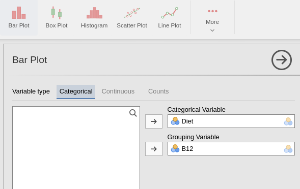
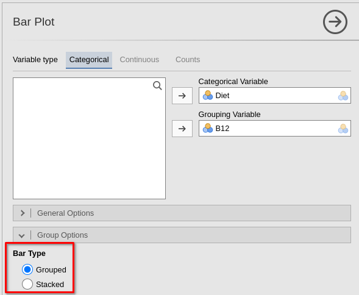
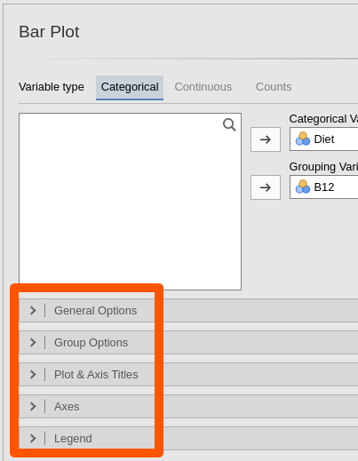
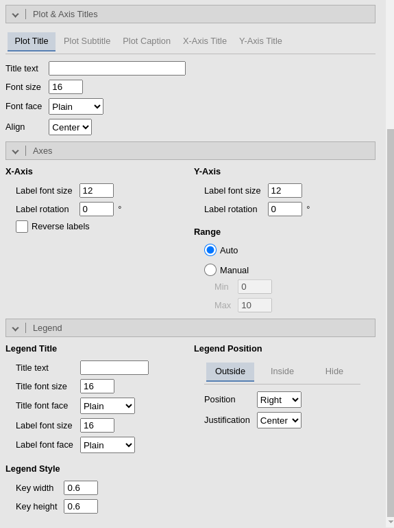

# jamovi: creating and editing plots {#jamoviPlots}


```{block2, type="rmdobjectives"}
**Topics** covered in this chapter:

* Creating plots in jamovi.
* Editing plots in jamovi.

```


```{block2, type="rmddatafile"}
The data files used in this section can be downloaded in Sect. \@ref(DataFiles).

You can download the data, and follow the instructions.
```


## Introduction

Graphs in jamovi are **best created using the Plot menu** (though they can also be created as part of the **Analyses**,
and sometimes through the **Exploration** menu).

Using the **Plot** menu allows the plot to be properly edited.


## Bar charts

### Creating bar charts

For this section, the data introduced in Sect. \@ref(B12Data) are used.

1. **Use the jamvoi menu:** select **Plot**.
2. **Add the variables**.
   Add the variables to the rows and columns (in this case, the `Categorical Variable` is `Diet`, and the `Grouping Variable` is `B12`).

```{r jamoviTwotFacePlant-SelectBar, echo=FALSE, fig.cap="Adding the variables to create a side-by-side bar chart in jamovi.", fig.align="center", out.width="70%"}

```


Your graph will appear in the jamovi Output window.

3. To change the **type** of bar chart (i.e., stacked barchart or side-by-side barchart), select the `Group Options` and then the type of bar chart you would like:

```{r jamoviTwotFacePlant-SelectBar-Type, echo=FALSE, fig.cap="Adding the variables to create a side-by-side bar chart in jamovi.", fig.align="center", out.width="70%"}

```

General changes--- such as editing axis labels and titles---are discussed in Sect.\ \@ref(jamoviEditingPlots).


## Boxplots

### Creating boxplots

For this section, the data introduced in Sect. \@ref(jamoviLeanAngle) are used.

1. **Use the jamovi menu:** select **Plot**.
2. **Add the variables**.
   Place the quantitative variable in the *Variables* area, and the qualitative variable in the **Grouping variable 1** area.
   
```{r jamoviTwotFacePlant-Boxplot, echo=FALSE, fig.cap="Selecting the variables for a boxplot.", fig.align="center", out.width="70%"}
knitr::include_graphics( "jamoviImages/TwoInd/FacePlant-Boxplot.png" )
```

Your graph will appear in the jamovi Output window.


### Editing boxplots

Some boxplot-specific options can be edited by selecting the **General Options**.
You probably will not need to change any of these options.

General changes--- such as editing axis labels and titles---are discussed in Sect.\ \@ref(jamoviEditingPlots).


##  Error bar charts {#jamoviErrorbar}

Error bar charts are produced as part of the *analysis*: see Chap. \@ref(jamoviTwoSampleT).
These cannot be edited further.


## Editing plots {#jamoviEditingPlots}

The options to **edit** box plots and bar charts are at the bottom of the plot window (Fig.\ \@ref(fig:jamoviEditBarChartOptions)).


```{r jamoviEditBarChartOptions, echo=FALSE, fig.cap="The plotting options for bar charts", fig.align="center", out.width="50%"}

```


Clicking on the options reveals the things that can be changed (Fig.\ \@ref(fig:jamoviEditBarChartOptionsExpanded)):

* **Plot and Axis Titles**:
  - The **Plot Title**:
    The plot title must be *meaningful* and *contextual*
  - The **Plot Subtitle**:
    The plot subtitle may not be necessary.
  - The **Plot Caption**:
    The *caption* can be added here, or can be added after pasting the plot into your document.
  - The **X-Axis Title**:
    The label on the horizontal (`X`) axis must be *meaningful* and *contextual*.
  - The **Y-Axis Title**:
    The label on the vertical (`Y`) axis must be *meaningful* and *contextual* (and including units of measurement when appropriate).
* **Axes**:
  You *may* also need to adjust the upper and lower limits of the `Y` axis (called the **Range**)
* **Legend**:
  The plot legend can be adjusted here if necessary.
  Importantly, the legend title  must be *meaningful* and *contextual*.
  
Your changes will be evident in plot in the jamovi Output window.
  
```{r jamoviEditBarChartOptionsExpanded, echo=FALSE, fig.cap="The plottimg options expanded for bar charts", fig.align="center", out.width="70%"}

```


