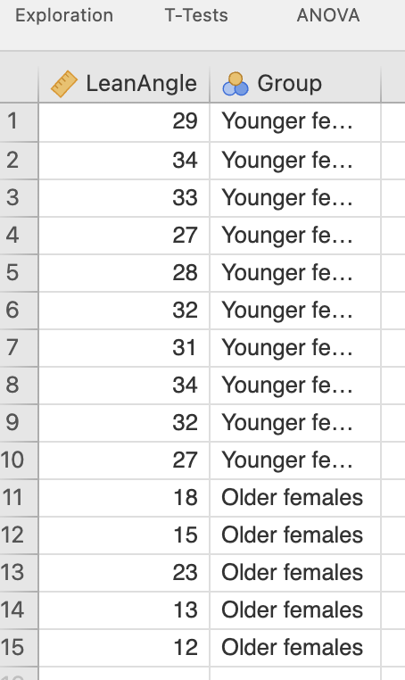
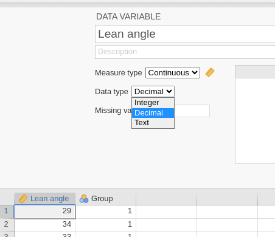
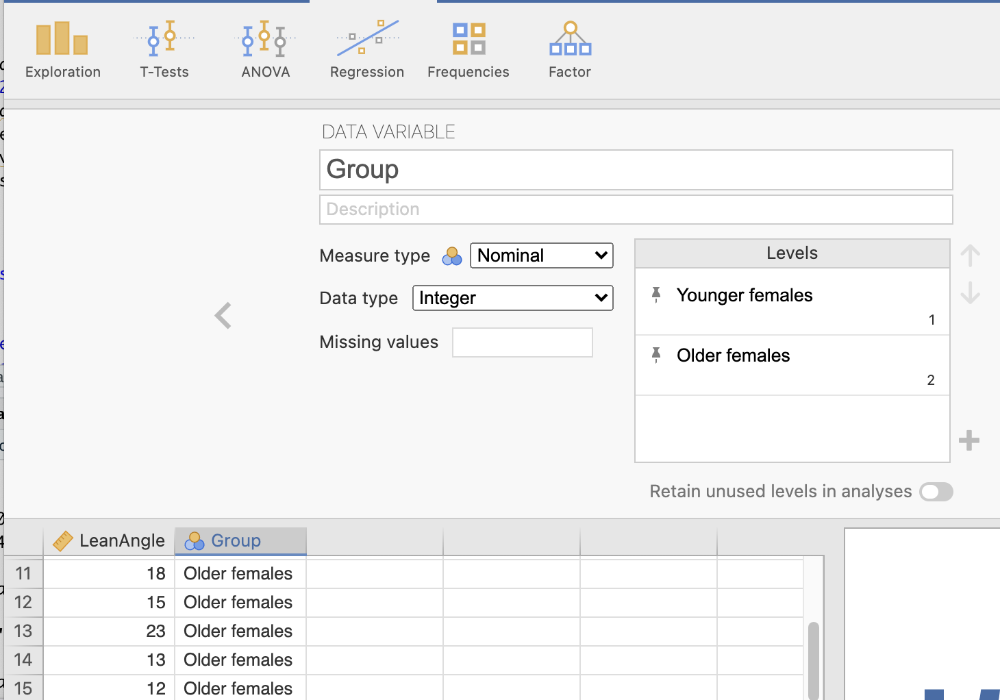
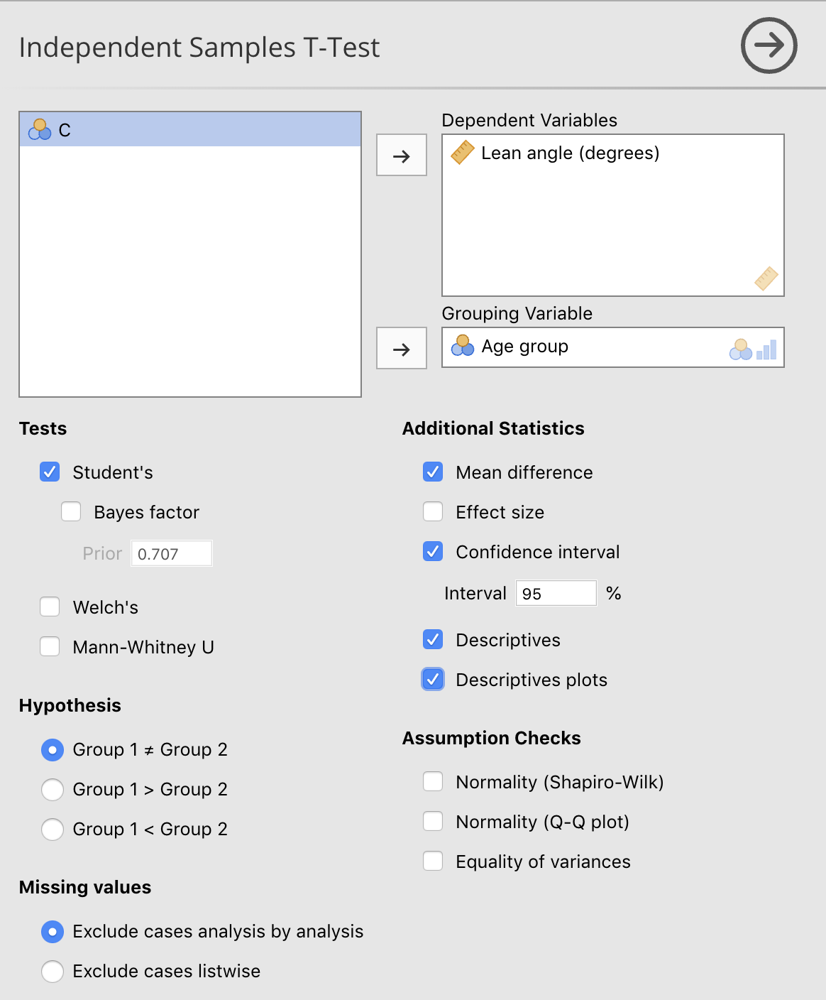

# jamovi: inference about the difference between two means {#jamoviTwoSampleT}


```{block2, type="rmdobjectives"}
**Topics** covered in this tutorial:
  
* Learn how to use jamovi for comparing two means.

```


## Introduction {#jamoviLeanAngle}

Two independent sample $t$-tests are used to compare the means of two separate groups.

Consider the face-plant data [@data:Wojcik:ForwardFall] [used in Exercise\ 30.11 of the textbook](https://bookdown.org/pkaldunn/SRM-Textbook/AnalysisTwoMeans.html) (Table\ \@ref(tab:jamoviFacePlant)).


```{block2, type="rmddatafile"}
The data file (`ForwardFall.csv`) can be downloaded in Sect. \@ref(DataFiles).

You can download the data, and follow the instructions.
```


```{r jamoviFacePlant, echo=FALSE}
FacePlant <- cbind( 
  c(29, 32, 34, 31, 33),
  c(34, 27, 32, 28, 27),
  c(18, 15, 23, 13, 12) 
)

if( knitr::is_latex_output() ) {
  kable( FacePlant,
         format = "latex",
         longtable = FALSE,
         booktabs = TRUE,
         align = c("c", "c", "c"),
         #col.names=rep("", 3),
         caption = "Lean- angles for older and younger women.") %>%
    add_header_above(header = c("Younger women " = 2, 
                                "Older women " = 1), 
                     bold = TRUE, 
                     align = "c") %>%
    kable_styling(font_size = 10)
  
}
if( knitr::is_html_output() ) {
  kable( FacePlant,
         format = "html",
         longtable =FALSE,
         booktabs = TRUE,
         align = c("c", "c", "c"),
         col.names = rep("", 3),
         caption = "Lean- angles for older and younger women.") %>%
    kable_styling(full_width = FALSE) %>%
    add_header_above(header = c("Younger women " = 2, 
                                "Older women " = 1), 
                     bold = TRUE, 
                     align = "c")
}
```


## Data entry {#jamoviTwoSampleDataEntry}

In the **Data** area, each row represents a unit of analysis (in this case, a person), as is usual in jamovi (Fig.\ \@ref(fig:jamoviTwotFacePlantData)).


Each unit of analysis gets two variables recorded: one is quantitative (**Lean angle (in degrees)**), and one is qualitative (**Age group**).
So there are two columns in the data, one for each variable.

The order of the variables doesn't matter, but here the quantitative variable is listed first (the lean- angle), and then the qualitative variable (the age group).


The variables need to be properly set up (by double-clicking on the variable names); see Figs.\ \@ref(fig:jamoviTwotFacePlantvarsAngle) and \@ref(fig:jamoviTwotFacePlantAgegroup).


```{r jamoviTwotFacePlantData, echo=FALSE, fig.cap="The data entered in jamovi.", fig.align="center", out.width="30%"}

```


```{r jamoviTwotFacePlantvarsAngle, echo=FALSE, fig.cap="Describing the quantitative variable.", fig.align="center", out.width="70%"}

```


```{r jamoviTwotFacePlantAgegroup, echo=FALSE, fig.cap="Describing the qualitative variable.", fig.align="center", out.width="70%"}

```


The two age groups are defined so that a `1` represents younger women, and a `2` represents older women.
In the jamovi worksheet, the values `1` and `2` were entered, but jamovi shows what these mean in the worksheet when these values are defined.


## Analysis {#jamoviTwoSampleAnalysis}


Remember, **this data set is available from the textbook as `ForwardFall.csv`** in [Appendix\ A](https://bookdown.org/pkaldunn/SRM-Textbook/AppendixDataSets.html).
You can download the data and follow along if you wish.

1. **Use the jamovi menu**: select **Analyses> T-Tests> Independent Samples T-Test**
2. **Select the Variables**.
   - For the **Dependent  Variables**, add the quantitative variable (here, `LeanAngle`).
   - For the **Grouping Variable**, add the qualitative variable (here, `Group`).

3. Then select the options:
  - `Student's` and `Welch's` should be select to perform the hypothesis test and compute the CIs.
  - `Mean difference` to show the difference between the two means in the output.
  - `Confidence interval` to show the CI for the difference between the two means.
  - `Descriptives` to show the numerical summary of each group.
  - `Descriptives plot` to show the error bar chart.
  
  
```{block2, type="rmdimportant"}
Even if you have a one-tailed hypothesis, keep the hypotheses as the two-tailed (first) option, or you will get some strange output.
The one-tailed $P$-value will be half the two-tailed $P$-value.
```


```{r jamoviTwotFacePlant-TTest, echo=FALSE, fig.cap="Enter the variables"., fig.align="center", out.width="70%"}

```


4. You will have your output in the jamovi Output window.


## Numerical summaries {#jamoviTwoSampleNumericalSummaries}

The *mean*, *median*, *standard deviation* and *standard error* of each group
are produced as part of the output
from the $t$-test analysis step above.

The *mean* and *standard error* for the *difference*
is obtained from the $t$-test output too.


