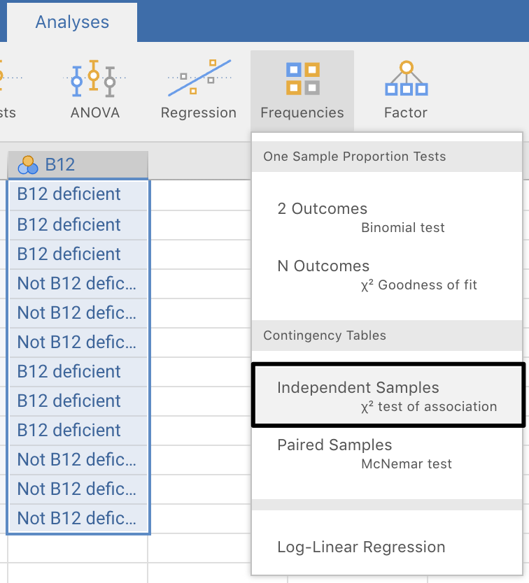
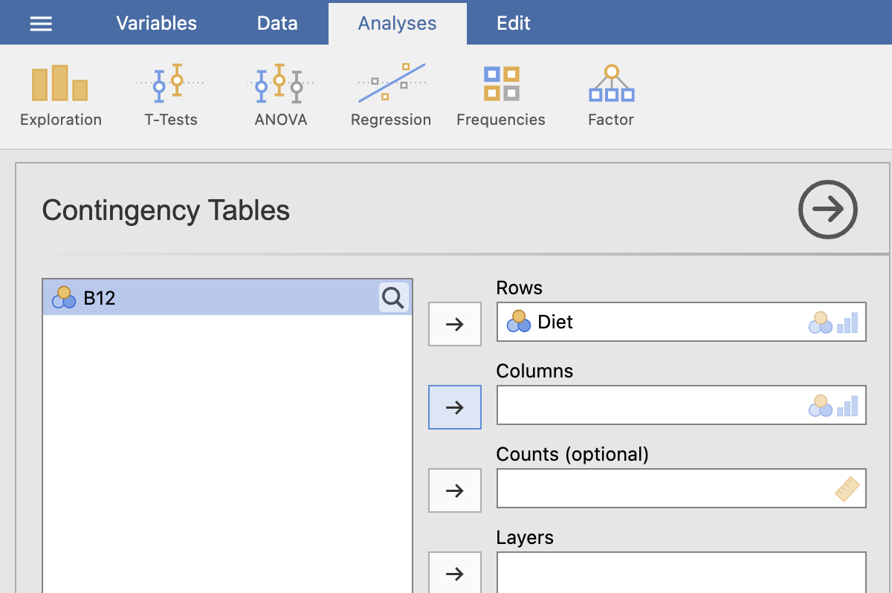
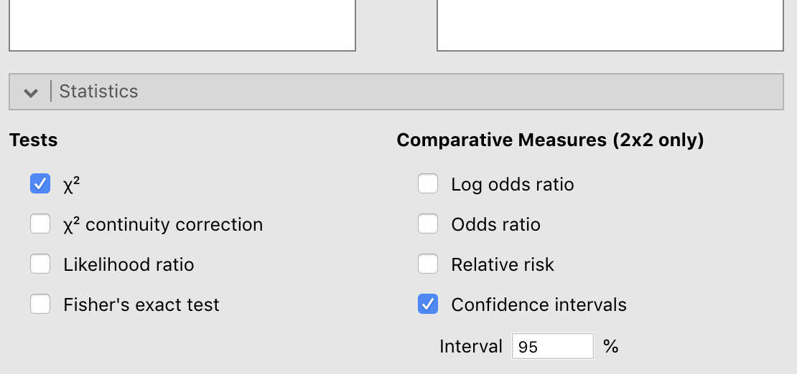
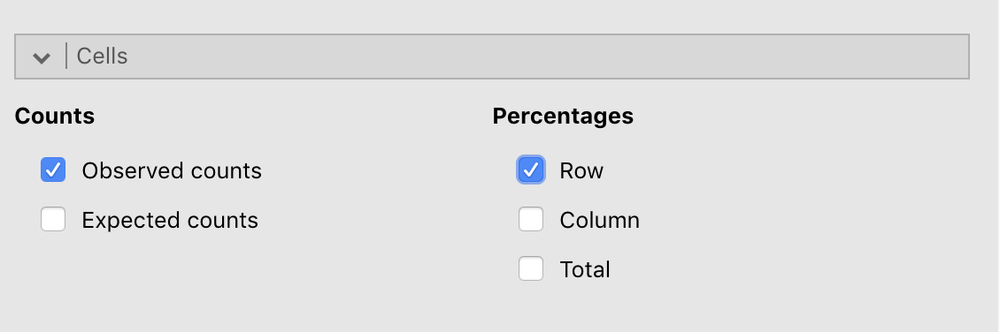

# jamovi: inference for two odds or two proportions  {#jamoviChisquare}


```{block2, type="rmdobjectives"}
In this chapter, you will learn to:
  
* use jamovi for comparing two odds (i.e., analysis using odds ratios).
* use jamovi for comparing two proportions.

```


## Data entry {#jamoviChiSquareDataEntry}

For this section, the data introduced in Sect. \@ref(B12Data) are used.
The data should be set up as described in Chap.\ \@ref(jamoviDataEntry).
In the data:

* **Diet**: `1` means 'Vegetarian' (i.e. in Row\ 1 of the data table), and `2` means 'Non-vegetarian' (i.e. in Row\ 2 of the data table in Table\ \@ref(tab:jamoviB12Data)).
* **B12**: `1` means 'B12 deficient' (i.e. in Column\ 1 of the data table), and `2` means '*Not* B12 deficient' (i.e. in Column\ 2 of the data table in Table\ \@ref(tab:jamoviB12Data)).

The data needs to be set up so that *each row represents one unit of analysis*.
That means there are $124$\ rows of data: one for each person (unit of analysis).


## Analysis {#jamoviChiSquareAnalysis}


This data set is available in Appendix\ \@ref(DataFiles).
Once the data are entered or loaded, we can begin analysis:

1. **Use the menu:** select **Analyses> Frequencies> Independent samples ($\chi^2$ test of association)** (Fig.\ \@ref(fig:jamoviChisqB12Menu)).

```{r jamoviChisqB12Menu, echo=FALSE, fig.cap="Select the correct test.", fig.align="center", out.width="50%"}

```


2. **Select the variables:** dragging them from the left panel to the **Rows** and **Columns** areas as appropriate (Fig.\ \@ref(fig:jamoviChisqB12Analysis)).
In Table\ \@ref(tab:jamoviB12Data), **Diet** is in the rows of the table, for example.


```{r jamoviChisqB12Analysis, echo=FALSE, fig.cap="Enter the variables.", fig.align="center", out.width="50%"}

```


3. **Select the analysis options:** Under the area where you entered the variables, select the right-pointing arrow beside **Statistics**, and then (Fig.\ \@ref(fig:jamoviChisqB12AnalysisStatsTicks)):

    - Select `X2`: this conducts the $\chi^2$ hypothesis test for comparing odds.
    - Select `z test for difference in 2 proportions`: this conducts the $z$-test to compare proportions.
    - Select `Odds ratio`: this shows the value of the odds ratio.
    - Select `Difference in proportions`: this shows the difference between the two proportions.
    - Select `Confidence intervals`: this shows a CI for the odds ratio, and a CI for the difference between the proportions.


```{r jamoviChisqB12AnalysisStatsTicks, echo=FALSE, fig.cap="Check the correct options.", fig.align="center", out.width="60%"}

```

4. You will have your output in the jamovi Output window on the right.


## Numerical summaries {#jamoviChiSquareNumericalSummaries}

*Percentages* can be obtained from the same place: **Analyses> Frequencies Independent samples ($\chi^2$ test of association)**.
Under the area where you selected the **Statistics**, select the right-pointing arrow beside **Cells** (Fig.\ \@ref(fig:jamoviChisqB12AnalysisCellsTicks)), and then:

* Select `Row` under the **Percentages** section; and/or
* Select `Column` under the **Percentages** section.

```{r jamoviChisqB12AnalysisCellsTicks, echo=FALSE, fig.cap="Select what to show in the table.", fig.align="center", out.width="60%"}

```

Of course, you can select any of the other options too, and see what happens.


