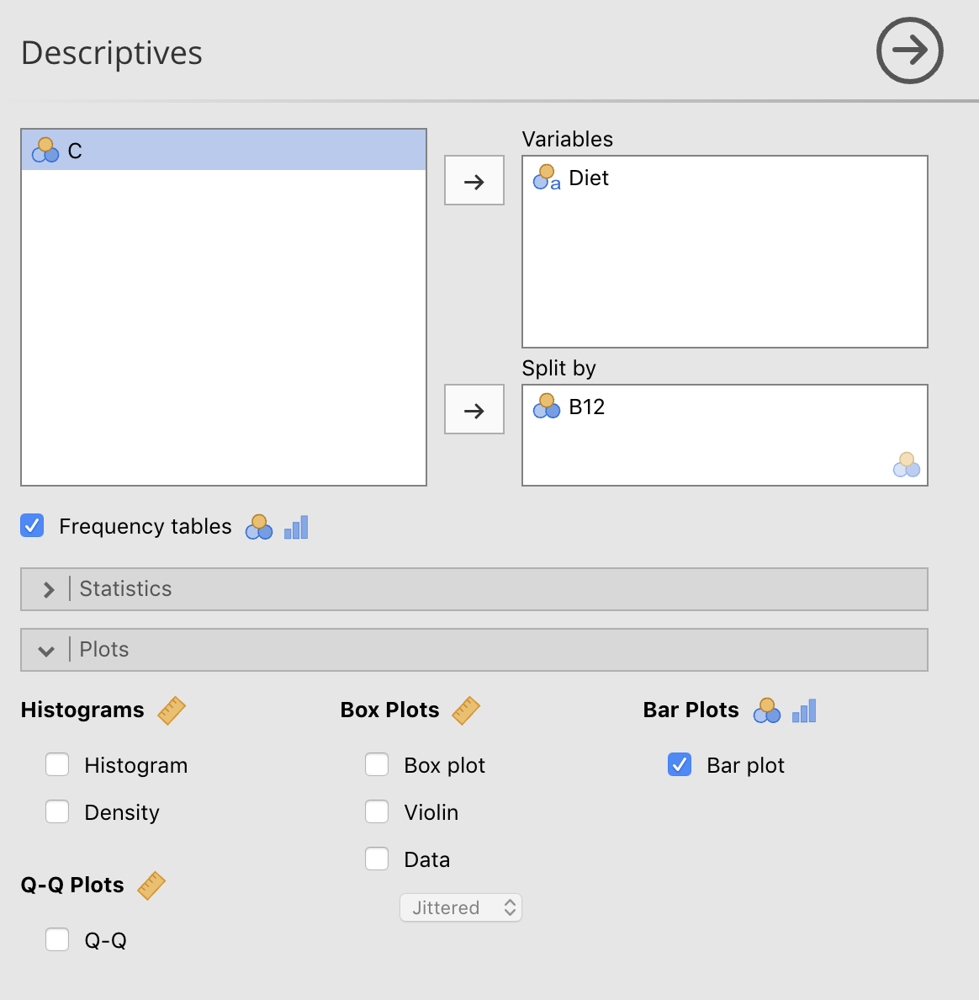
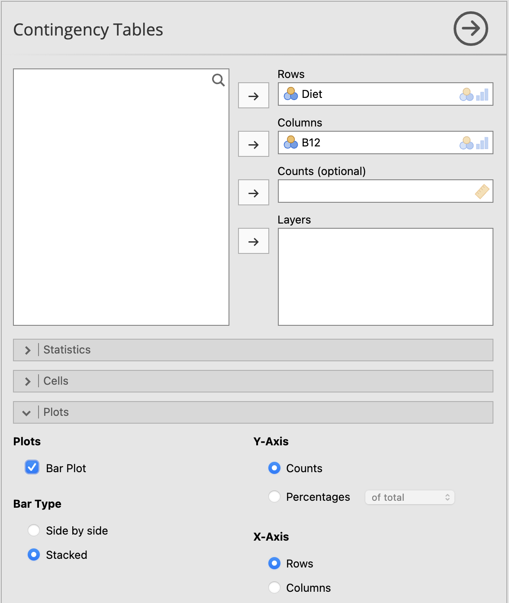

# Graphs in jamovi {#jamoviGraphs}


```{block2, type="rmdobjectives"}
**Topics** covered in this tutorial:

* Creating graphs in jamovi

```	

Graphs in jamovi are sometimes produced as part of the **Analyses**,
and sometimes through the **Exploration** menu.
	

## Side-by-side bar charts {#jamovi:SideBySide}

	
### Using older version of jamovi (on USC computer labs)

For this section,
the data introduced in Sect. \@ref(B12Data) are used.

1. **Use the jamvoi menu:**
   select
   **Analyses: Exploration: Descriptives**

2. **Add the variables**.
   Add the first division of the side-by-side bar chart (in this case, **Diet**) to the **Variables** area;
   then add the second qualitative variable to the 
   **Split by** area.

3. Click on the right-pointing arrow next to **Plots**,
   and select the option **Bar plot**.
   (You may like to also select the **Frequency tables** option too.) 


```{r jamoviTwotFacePlant-Barplot, echo=FALSE, fig.cap="Adding the variables to create a stacked bar chart", fig.align="center", out.width="50%"}

```


4. You will have your graph in the Output window.

### Using newer version of jamovi

There is an alternative way to produce side-by-side bar charts in more recent (stable) versions of jamovi produce stacked bar charts.
This method is more flexible.
This version of jamovi is not currently installed on USC computers.

The most recent (stable) versions of jamovi, 
available from https://www.jamovi.org/.


```{block2, type="rmdtip"}
The instructions below only work with jamovi versions greater than 1.6.14 (09 February 2021).
```


For this section,
the data introduced in Sect. \@ref(B12Data) are used.

1. **Use the jamvoi menu:**
   select
   **Analyses: Frequencies: Independent samples ($\chi^2$ test of association)**.

2. **Add the variables**.
   Add the variables to the rows and columns (in this case, the `Rows` is **Diet** and the `Columns` is **B12**).

3. Click on the right-pointing arrow next to the **Plots** option from the bottom of the left-side screen.

4. Select **Plots** and `Bar Plot`; then select **Bar Type** and the `Side by side` option.

```{r jamoviTwotFacePlant-Stacked-Barplot-new, echo=FALSE, fig.cap="Adding the variables to create a side-by-side bar chart in newer version of jamovi", fig.align="center", out.width="50%"}
knitr::include_graphics( "jamoviImages/Chisq/B12-Barplot-Sidebyside.png" )
```

5. You can change the vertical (or **Y**) axis to represent either counts or percentages by your selection under **Y-Axis**.
6. You can change which variables is on the horizontal (or **X**) axis by your selection under **X-Axis**.
6. You will have your graph in the Output window.


## Stacked bar charts {#jamovi:Stacked}

At present,
only the most current (stable) versions of jamovi produce stacked bar charts.
In particular,
the version of jamovi currently installed on USC computers does **not** produce stacked bar charts.

The most recent (stable) versions of jamovi, 
available from https://www.jamovi.org/,
**do** produce stacked bar charts.
We explain how to create these below.


```{block2, type="rmdtip"}
The instructions below only work with jamovi versions greater than 1.6.14 (09 February 2021).
```


For this section,
the data introduced in Sect. \@ref(B12Data) are used.

1. **Use the jamvoi menu:**
   select
   **Analyses: Frequencies: Independent samples ($\chi^2$ test of association)**.

2. **Add the variables**.
   Add the variables to the rows and columns (in this case, the `Rows` is **Diet** and the `Columns` is **B12**).

3. Click on the right-pointing arrow next to the **Plots** option from the bottom of the left-side screen.

4. Select **Plots** and `Bar Plot`; then select **Bar Type** and the `Stacked` option.

```{r jamoviTwotFacePlant-Stacked-Barplot, echo=FALSE, fig.cap="Adding the variables to create a side-by-side bar chart in newer version of jamovi", fig.align="center", out.width="50%"}

```

5. You can change the vertical (or **Y**) axis to represent either counts or percentages by your selection under **Y-Axis**.
6. You can change which variables is on the horizontal (or **X**) axis by your selection under **X-Axis**.
6. You will have your graph in the Output window.


## Boxplots {#jamovi:Boxplot}


For this section, the data introduced in Sect. \@ref(jamoviLeanAngle) are used.


1. **Use the jamovi menu:** select
  **Analyses: Exploration: Descriptives**.

2. **Add the variables**.
   Place the quantitive variable in the *Variables* area,
   and the qualitative variable in the **Split by** area.
		
3. Then, click on the right-pointing arrow next to **Plots**,
   and select **Box Plots**, and then **Box plot**.
4. You will have your graph in the jamovi Output window.


```{r jamoviTwotFacePlant-Boxplot, echo=FALSE, fig.cap="Selecting the variables for a boxplot", fig.align="center", out.width="50%"}
knitr::include_graphics( "jamoviImages/TwoInd/FacePlant-Boxplot.png" )
```


## Error bar charts {#jamovi:Errorbar}

Error bar charts are produced as part of the *analysis*:
see Chap. \@ref(jamovi:TwoSampleT).


## Editing graphs {#jamovi:EditGraphs}

At the time these notes were prepared,
*jamovi does not allow graphs to be edited*
(but it is promised to be coming soon).


