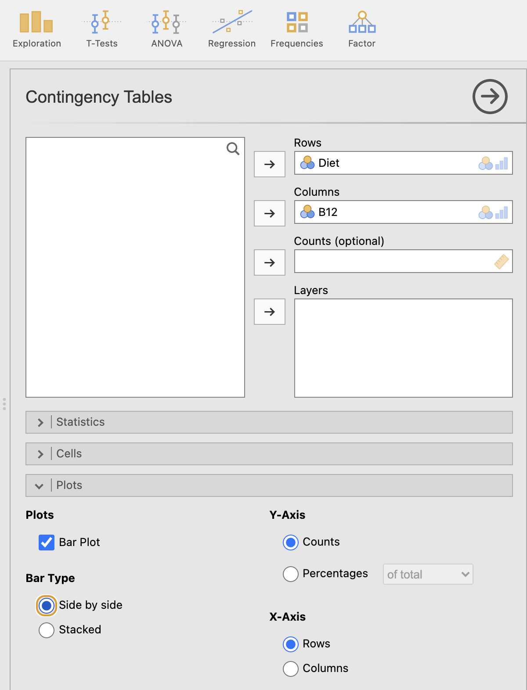
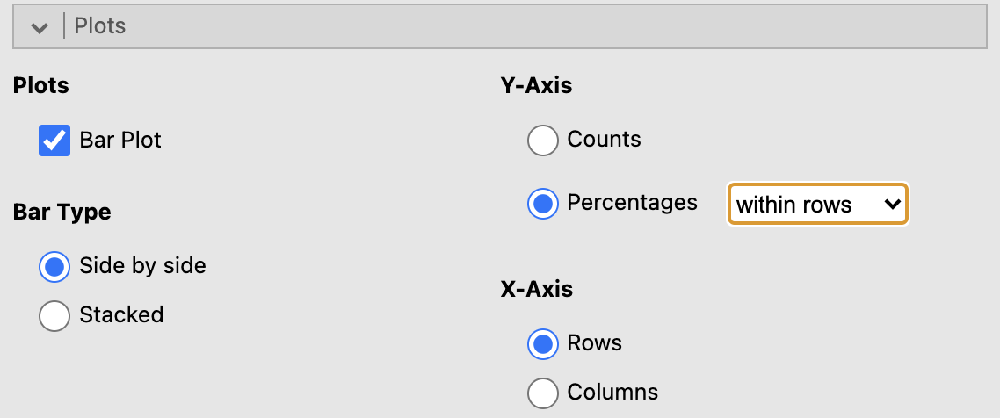
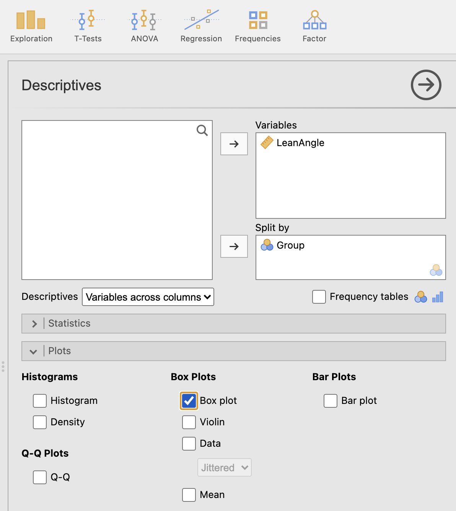

# Graphs in jamovi {#jamoviGraphs}


```{block2, type="rmdobjectives"}
**Topics** covered in this tutorial:

* Creating graphs in jamovi

```	


```{block2, type="rmddatafile"}
The data files used in this section can be downloaded in Sect. \@ref(DataFiles).

You can download the data, and follow the instructions.
```


Graphs in jamovi are sometimes produced as part of the **Analyses**,
and sometimes through the **Exploration** menu.


## Bar charts (side-by-side; stacked) {#jamoviSideBySide}

For this section,
the data introduced in Sect. \@ref(B12Data) are used.

1. **Use the jamvoi menu:**
   select
   **Analyses: Frequencies: Independent samples ($\chi^2$ test of association)**.

2. **Add the variables**.
   Add the variables to the rows and columns (in this case, the `Rows` is **Diet** and the `Columns` is **B12**).

3. Click on the right-pointing arrow next to the **Plots** option from the bottom of the left-side screen.

4. Select **Plots** and `Bar Plot`; then select **Bar Type**. You can select either a `Side by side` bar chart, or a `Stacked` bar chart.

```{r jamoviTwotFacePlant-Stacked-Barplot-new, echo=FALSE, fig.cap="Adding the variables to create a side-by-side bar chart in jamovi", fig.align="center", out.width="50%"}

```

5. You can change the vertical (or **Y**) axis to represent either counts or percentages by your selection under **Y-Axis**.
6. You can change which variables is on the horizontal (or **X**) axis by your selection under **X-Axis**. There are plenty of options, so feel free to experiment. A useful one is to select `Percentages within rows`.

```{r jamoviTwotFacePlant-Stacked-Barplot-options, echo=FALSE, fig.cap="Adding the variables to create a side-by-side bar chart in jamovi", fig.align="center", out.width="50%"}

```

6. You will have your graph in the Output window.


## Boxplots {#jamoviBoxplot}


For this section, the data introduced in Sect. \@ref(jamoviLeanAngle) are used.


1. **Use the jamovi menu:** select
  **Analyses: Exploration: Descriptives**.

2. **Add the variables**.
   Place the quantitive variable in the *Variables* area,
   and the qualitative variable in the **Split by** area.
		
3. Then, click on the right-pointing arrow next to **Plots**,
   and select **Box Plots**, and then **Box plot**.
4. You will have your graph in the jamovi Output window.


```{r jamoviTwotFacePlant-Boxplot, echo=FALSE, fig.cap="Selecting the variables for a boxplot", fig.align="center", out.width="50%"}

```


## Error bar charts {#jamoviErrorbar}

Error bar charts are produced as part of the *analysis*:
see Chap. \@ref(jamoviTwoSampleT).


## Editing graphs {#jamoviEditGraphs}

At the time these notes were prepared,
*jamovi does not allow graphs to be edited*
(but it is promised to be coming soon!).


