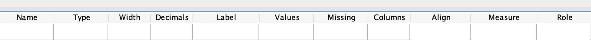

# (PART) Using SPSS {-}


# General information about using SPSS {#SPSSGeneral}


```{block2, type="rmdobjectives"}
**Topics** covered in this chapter:

* Introducing some tips for working with SPSS

```


Before starting analysis with SPSS [@Software:SPSS],
here are some **general tips**:

*	In general, you cannot download a copy of SPSS for use at home (which you *can* do with jamovi).
*	*Except for graphs*, SPSS output should **not** be presented in reports or presentations.  
   Instead, the information from SPSS output should be used to construct proper tables, or to produce proper conclusions. 
* SPSS has two worksheets sheets; **both** must be set up correctly
	(you can switch between the two worksheets by clicking on these at the bottom of the SPSS window):
    - The **Data View**, which contains the data.
    - The **Variable View**, which contains information *about* each variable.

* In SPSS (as with most statistical software), *each row represents one unit of analysis* in the **Data View**.
* In SPSS (as with most statistical software), *each column represents one variable* in the **Data View**.
* At the top of each column (but **not** in Row 1!) is the *name* of the variable;
* When setting up the **Variable View**, many columns can be filled in (Fig. \@ref(fig:SPSSVariables1)).
  These are the important columns to get right (the others aren't important for our purposes):
    -  **Name**: A short description of the variable (with no spaces or punctuation!); for example `DiaBP`.
    - **Type**: Usually **Numeric** (apart from *names* which can be **String**).
    - **Label**: A fuller description of the variable. This is what will appear in tables and graphs to describe the variable.
		For example `Diastolic blood pressure (in mm Hg)`.
    - **Values**: For *qualitative* variables only: tell SPSS what each number represents
      (for example, does a 1 represent females, or males?)
    - **Measure**: *This is important*:
		You must tell SPSS whether each variable is nominal, ordinal, or scale (i.e. quantitative) by using the drop-down options.
* You can get help with using SPSS by:
    + Using [LinkedIn Learning](https://www.linkedin.com/learning/).
    - Watching software screencasts on Blackboard
    - Borrowing books in the library.
    - Asking SCI110 staff, including using the Discussion Board.


```{r SPSSVariables1, echo=FALSE, fig.cap="Information that can be given for each variable in the Variable View window)", fig.align="center", out.width="100%"}

```

	


