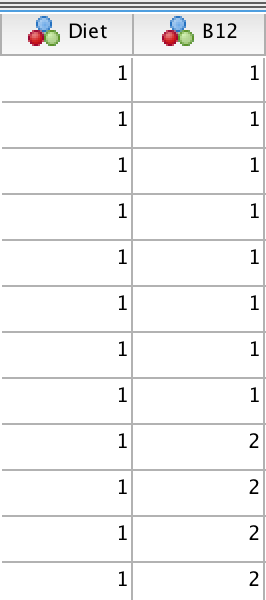
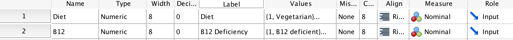
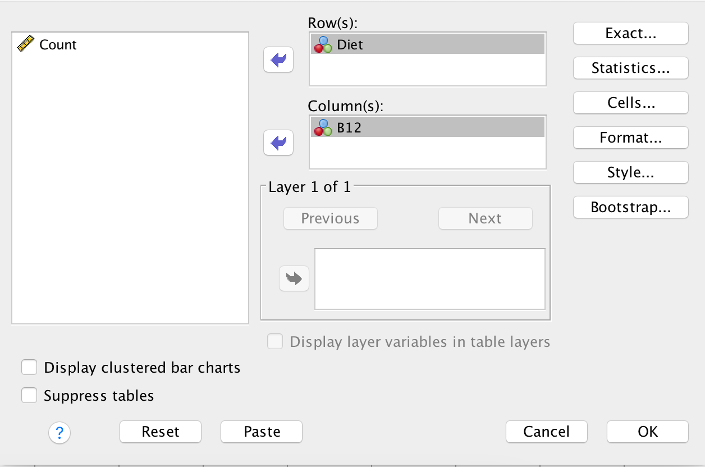
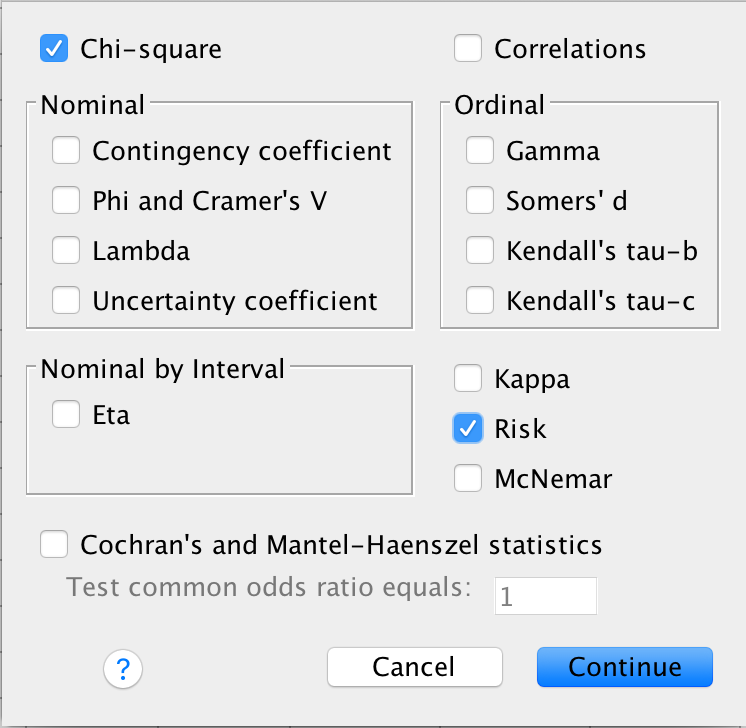

# Using SPSS for inference about ORs

```{block2, type="rmdobjectives"}
**Topics** covered in this tutorial:

* Confidence intervals for paired means

```


## Introduction {#SPSSB12Data}


$\chi^2$ tests ('*ki*-squared tests') are used to analyse data where each unit of analysis has
*two qualitative variables* measured (or observed) about it.
This type of data can be compiled into a two-way table of counts. 

Consider data [@data:Gammon2012:B12]
[used in the textbook](https://srm-course.netlify.app/b12deficiencyci)
(Table \@ref(tab:SPSSB12Data)).

Note there are *two variables* being measured on each individual:

1.  Whether the person is vegetarian (or not);
1.  Whether the person is B12 deficient (or not);

So SPSS will have *two columns*: 
One for each variable.


```{r SPSSB12Data,  echo=FALSE}
B12Data <- array( dim=c(3, 3) )

rownames(B12Data) <- c("Vegetarians",
                       "Non-vegetarians",
                       "Total")
colnames(B12Data) <- c("B12 deficient",
                       "Not B12 deficient",
                       "Total")

B12Data[1, ] <- c(8, 26, 34)
B12Data[2, ] <- c(8, 82, 90)
B12Data[3, ] <- c(16, 108, 124)
  
if( knitr::is_latex_output() ) {
  kable(B12Data,
        format="latex",
      booktabs = TRUE,
      longtable=FALSE,
      align=c("r", "r", "r"),
      caption="The number of vegetarian and non-vegetarian women who are (and are not) B12 deficient") %>%
    row_spec(0, bold=TRUE) %>%
    row_spec(3, bold=TRUE) %>%
    column_spec(4, bold=TRUE) %>%
    row_spec(2, hline_after = TRUE) %>%
    kable_styling(font_size=10)
  
}
if( knitr::is_html_output() ) {
  kable(B12Data,
        format="html",
      booktabs = TRUE,
      longtable=FALSE,
      align=c("r","r", "r"),
      caption="The number of vegetarian and non-vegetarian women who are (and are not) B12 deficient") %>%
    row_spec(0, bold=TRUE) %>%
    row_spec(3, bold=TRUE) %>%
    column_spec(4, bold=TRUE)
}
```


## Data entry {#SPSSChiSquareDataEntry}

In the SPSS **Variable View**,


* **Diet**: we can set this up so that 1 means 'Vegetarian' (i.e. in row 1), 
   and 2 means 'Non-vegetarian' (i.e. in row 2).
* **B12**: we can set this up so that 1 means 'B12 deficient' (i.e. in column 1),
  and 2 means '*Not* B12 deficient' (i.e. in column 2).

See Fig. \@ref(fig:SPSSVariables1).

The usual approach for data entry used by SPSS is that
*each row represents one unit of analysis*.
That means that there will be 124 rows of data: 
one for each person (unit of analysis).

In SPSS,
the data would be entered as shown in 
Fig. \@ref(fig:SPSSVariables1a),
but there would be 124 rows.

```{r SPSSVariables1a, echo=FALSE, fig.cap="Data entered into SPSS", fig.align="center", out.width="20%"}

```


So the **Variable View** would describe these two variables;
see Fig. \@ref(fig:SPSSVariables2).


```{r SPSSVariables2, echo=FALSE, fig.cap="Describing the variable in the Variable View window", fig.align="center", out.width="100%"}

```


## Analysis {#SPSSChiSquareAnalysis}

Once the data are entered, we can begin analysis:

1. **Use the menu:** select
   **Analyze: Descriptive Statistics: Crosstabs...**

2. **Select the variables**,
   dragging them from the left panel to the
   **Row(s)** and **Column(s)** areas as appropriate.
   In Table \@ref(tab:SPSSB12Data),
   **Diet** is in the rows of the table, for example.
   See Fig. \@ref(fig:SPSSB12VariablesIn).


```{r SPSSB12VariablesIn, echo=FALSE, fig.cap="Add the variables", fig.align="center", out.width="85%"}

```

3. **Select the analysis options.**
   Click the **Statistics...** button, 
   and then (Fig. \@ref(fig:SPSSB12Analysis)):
    - Select the **Chi-square** (to produce information for the hypothesis test);
    - Select the **Risk** option (to produce a CI for the odds ratio).

4. Press **Continue**, and then press **OK**. You will have your output in the SPSS Output window.


```{r SPSSB12Analysis, echo=FALSE, fig.cap="Select the options", fig.align="center", out.width="55%"}

```


## Numerical summaries {#SPSSChiSquare:NumericalSummaries}

**Percentages** can be obtained from **Analyze: Descriptive Statistics: Crosstabs...**
In the window that appears, select **Cells...** 
and then select **Percentages** as **Row**, as **Column**, or even as both if you wish.

*Odds* are computed as part of the inference output from
Sect. \@ref(SPSSChiSquareAnalysis).


