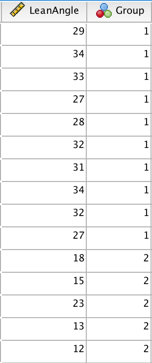
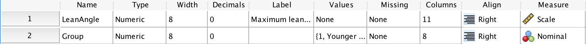
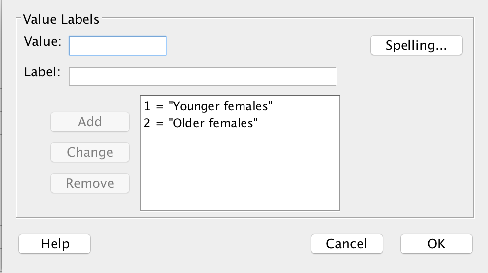
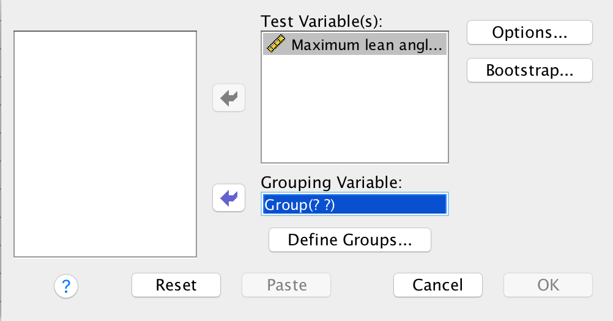
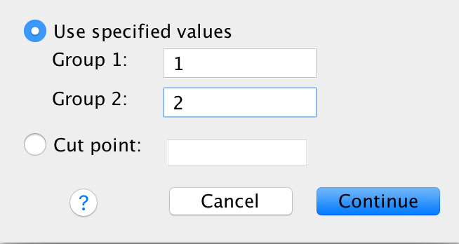

# SPSS: inference about the difference between two means {#SPSSTwoSampleT}


```{block2, type="rmdobjectives"}
**Topics** covered in this tutorial:
  
* Learn how to use SPSS for comparing two means.

```


## Introduction {#SPSSLeanAngle}


Two independent sample $t$-tests are used to compare the means of two separate groups.

Consider the face-plant data [@data:Wojcik:ForwardFall] [used in Exercise\ 30.11 of the textbook](https://bookdown.org/pkaldunn/SRM-Textbook/AnalysisTwoMeans.html) (Table\ \@ref(tab:SPSSFacePlant)).


```{r SPSSFacePlant, echo=FALSE}
FacePlant <- cbind( 
  c(29, 32, 34, 31, 33),
  c(34, 27, 32, 28, 27),
  c(18, 15, 23, 13, 12) 
)

if( knitr::is_latex_output() ) {
  kable( FacePlant,
         format = "latex",
         longtable = FALSE,
         booktabs = TRUE,
         align = c("c", "c", "c"),
         #col.names=rep("", 3),
         caption = "Lean-forward angles for older and younger women") %>%
    add_header_above(header = c("Younger women " = 2, 
                                "Older women " = 1), 
                     bold = TRUE, 
                     align = "c") %>%
    kable_styling(font_size = 10)
  
}
if( knitr::is_html_output() ) {
  kable( FacePlant,
         format = "html",
         longtable = FALSE,
         booktabs = TRUE,
         align = c("c", "c", "c"),
         col.names = rep("", 3),
         caption = "Lean-forward angles for older and younger women") %>%
    kable_styling(full_width = FALSE) %>%
    add_header_above(header = c("Younger women " = 2, 
                                "Older women " = 1), 
                     bold = TRUE, 
                     align = "c")
}
```


```{block2, type="rmddatafile"}
The data file (`forwardfall.sav`) can be downloaded in Sect. \@ref(DataFiles).

You can download the data, and follow the instructions.
```


## Data entry {#SPSSTwoSampleAnalysisDataEntry}

In the **Data View**, each row represents a unit of analysis (in this case,  a person), as is usual in SPSS.

Each unit of analysis gets two variables recorded on it: one is quantitative (`LeanAngle`), and one is qualitative (`Group`).
So there are two columns in the **Data View**, one for each variable.

The order doesn't matter, but here the quantitative variable is listed first (the lean-forward angle), and then the qualitative variable (the age group).

The **Variable View** needs to be set up correctly too (Fig.\ \@ref(fig:SPSSFacePlantVariablesIn)).
For example, all variables should be given a descriptive label.
The quantitative variable (here, `LeanAngle`) should be declared as **Scale** in the **Measure** column.
The qualitative variable (here, `Group`) should be declared as **Nominal** in the **Measure** column (Fig.\ \@ref(fig:SPSSFacePlantVariablesVV)).


```{r SPSSFacePlantVariablesIn, echo=FALSE, fig.cap="The data in the Data View", fig.align="center", out.width="30%"}

```


```{r SPSSFacePlantVariablesVV, echo=FALSE, fig.cap="The Variable View", fig.align="center", out.width="100%"}

```


The two age groups are defined so that a `1` represents younger women, and a `2` represents older women.
Since this is arbitrary, we tell SPSS this by setting the  **Values** in the **Variable View** (Fig.\ \@ref(fig:SPSSFacePlantVariablesLevels)).


```{r SPSSFacePlantVariablesLevels, echo=FALSE, fig.cap="Defining the levels (Values) for the age group, in the Variable View", fig.align="center", out.width="85%"}

```


## Analysis {#SPSSTwoSampleAnalysis}

1. **Use the SPSS menu**: select **Analyze> Compare Means> Independent Samples T Test...**
2. **Select the Variables**.
   The **Test Variable** is the quantitative variable (here, `LeanAngle`), and the **Grouping Variable** is the qualitative variable (here, ``Group`); see Fig.\ \@ref(fig:SPSSFacePlantVarsIn).


```{r SPSSFacePlantVarsIn, echo=FALSE, fig.cap="Entering the variables", fig.align="center", out.width="85%"}

```

3. **Define the groups to compare**.
   Click the button **Define Groups...** and enter the numbers that are being used to represent the two groups to be compared.
   In this example, the two groups are given the values `1` and `2` in the **Data View**, so we enter these.
4. Click the **Continue** button, then **OK**.
   You will have your output in the SPSS Output window.


```{r SPSSFacePlantVarsInwegcucwg, echo=FALSE, fig.cap="Teling SPSS which groups to compare", fig.align="center", out.width="50%"}

```


## Numerical summaries {#SPSSTwoSampleAnalysisNumericalSummaries}

The *mean*, *median*, *standard deviation* and *standard error* are produced as part of the output from the $t$-test analysis step above.

The *mean* and *standard error* for the *difference* is obtained from the $t$-test output too; see Sect.\ \@ref(SPSSTwoSampleAnalysis).


