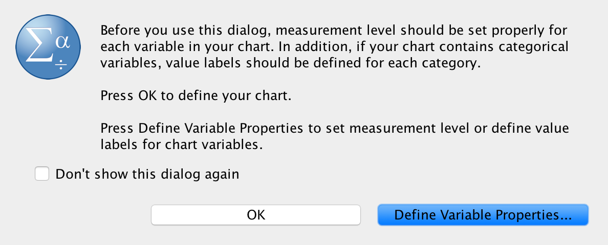
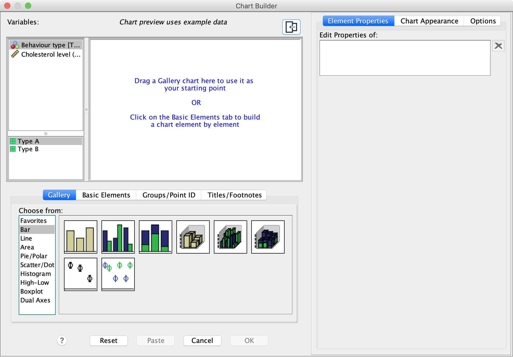
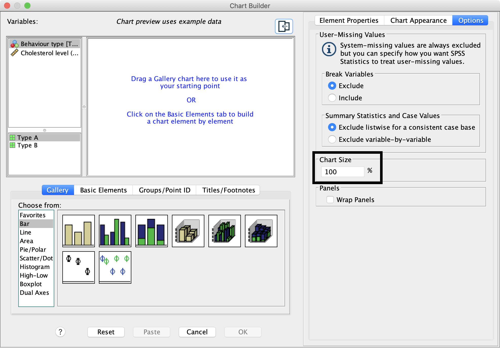
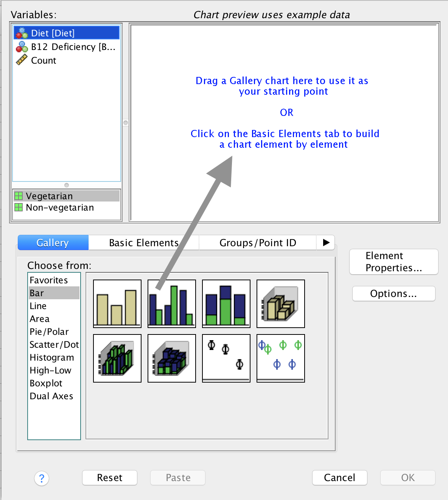
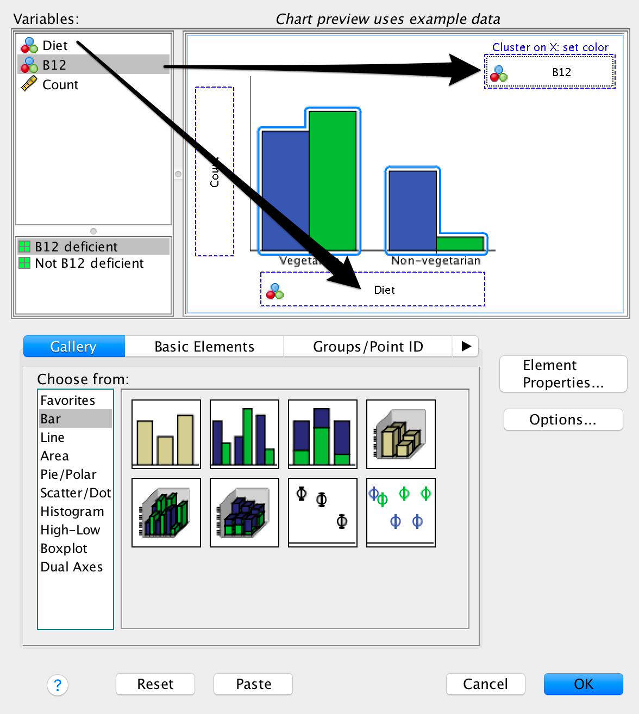
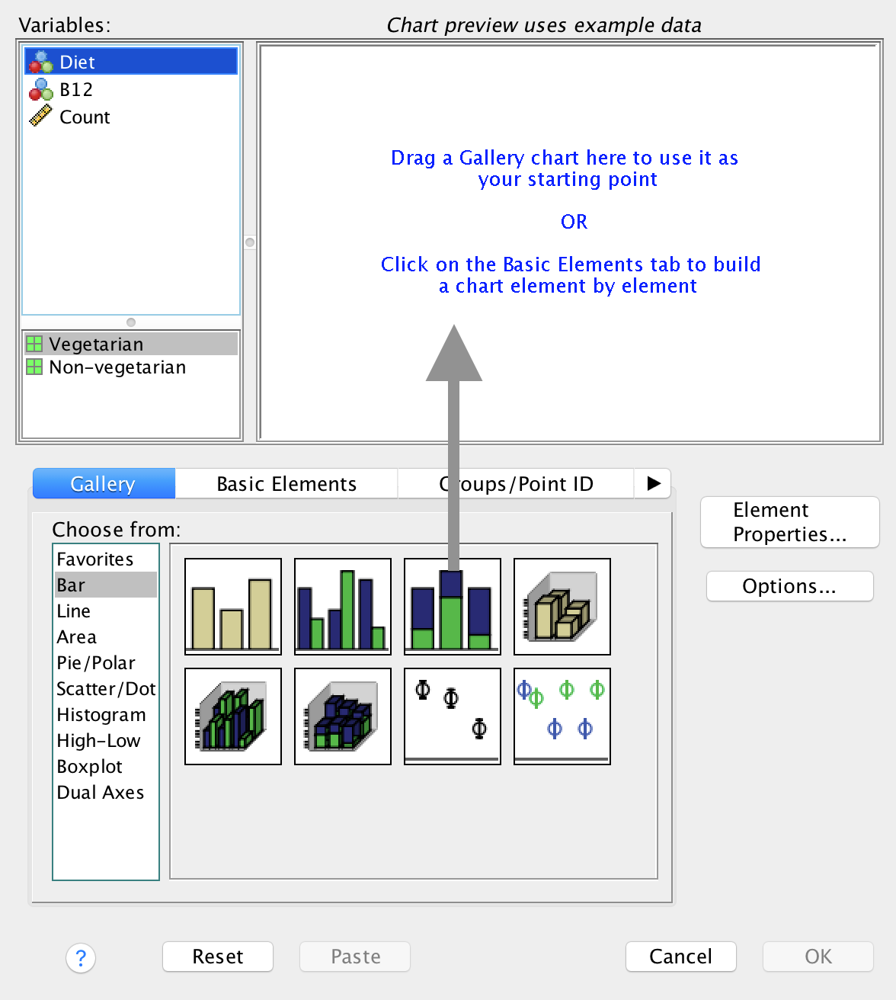
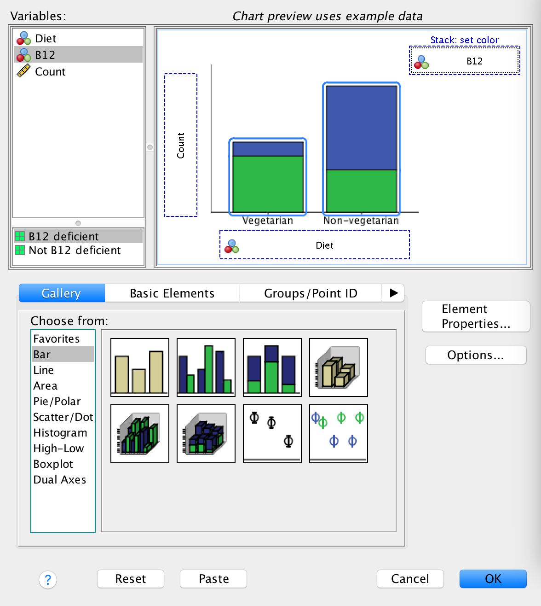
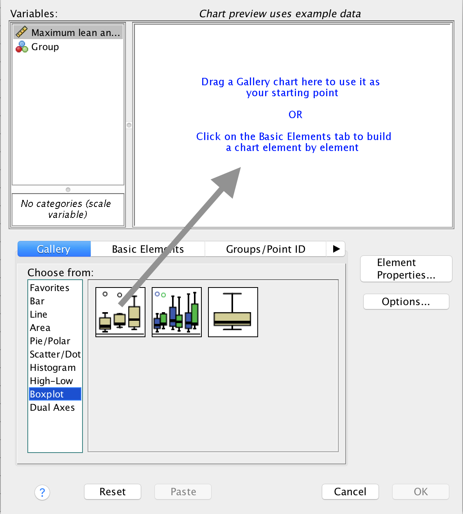
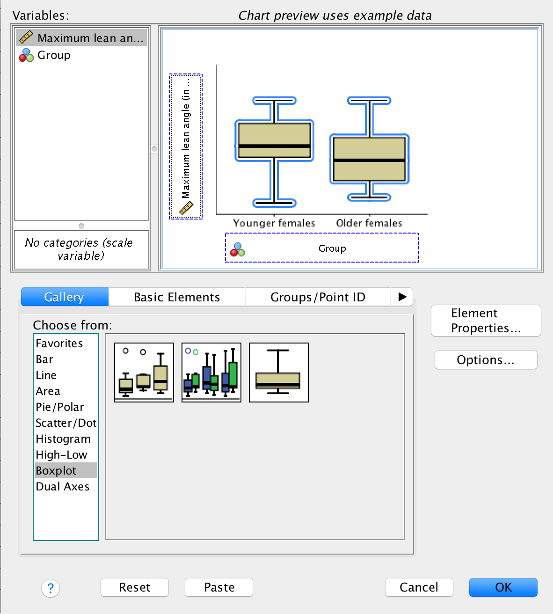
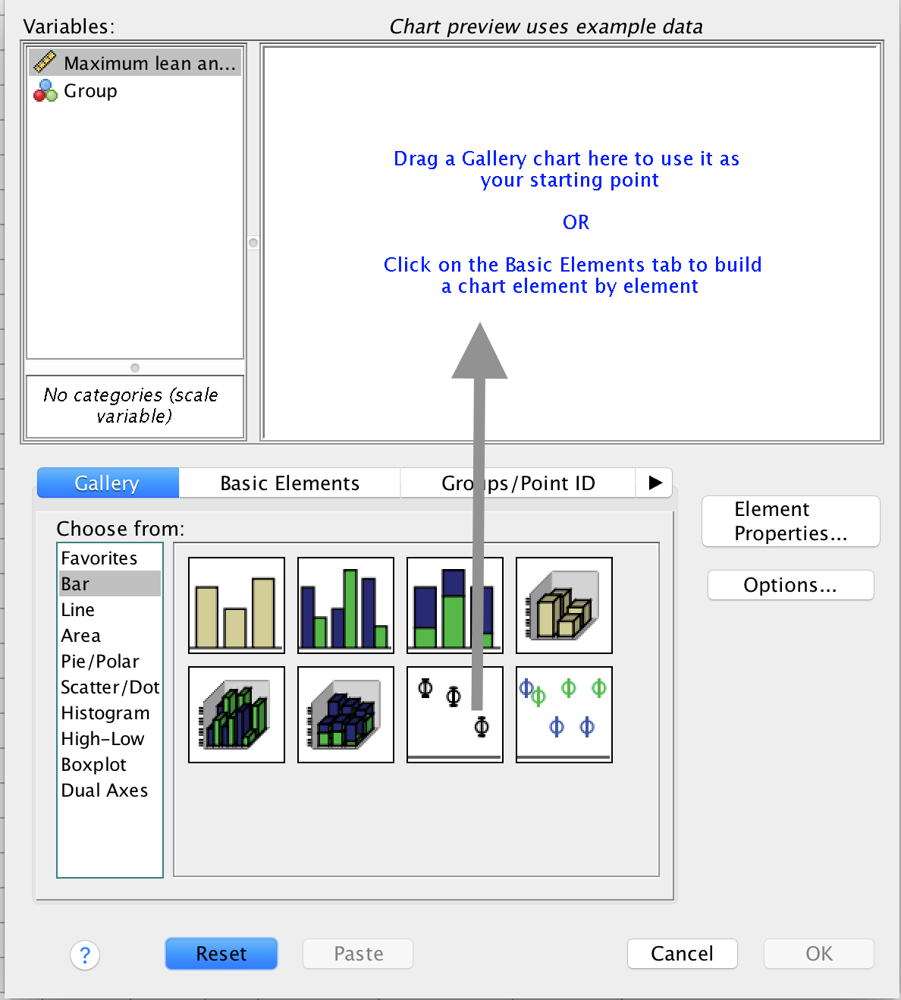

# SPSS: graphs {#SPSSGraphs}


```{block2, type="rmdobjectives"}
**Topics** covered in this tutorial:

* Creating graphs in SPSS.

```	
	


```{block2, type="rmddatafile"}
The data files used in this section can be downloaded in Sect. \@ref(DataFiles).

You can download the data, and follow the instructions.
```


Graphs in SPSS are generally produced using the **Graphs** menu, and then selecting **Chart Builder...**
	
After making this selection, you usually get a warning (Fig.\ \@ref(fig:SPSSGraphWarning))).
It is reminding you that it is **really important** that your have declared  the **Measure** correctly for each variable
in the **Variable View** (that is, correctly declared each variable as **Nominal**, **Ordinal** or **Scale**); see Sect.\ \@ref(SPSSGeneral).

Provided you have done so, you can press **OK**.


```{r SPSSGraphWarning, echo=FALSE, fig.cap="The warning after selecting Graphs", fig.align="center", out.width="85%"}

```


```{block2, type="rmdimportant"}
The graphs produced by default in SPSS are usually an inconvenient size for copying-and-pasting into Word, PowewrPoint, and other places.
We now explain the easy solution.
```


When graphs are created in SPSS using the **Chart Builder**, the window shown in Fig.\ \@ref(fig:SPSSChartBuilder) initially appears.
Select the **Options** item from the right-hand side of this window.


```{r SPSSChartBuilder, echo=FALSE, fig.cap="The Chart Builder window", fig.align="center", out.width="85%"}

```

Then, change the **Chart size** to (say) 60% or a similar value (Fig.\ \@ref(fig:SPSSChartBuilderOptions)).
Now, when you copy-and-paste the graph, the sizing will be more appropriate.


```{r SPSSChartBuilderOptions, echo=FALSE, fig.cap="The warning after selecting Graphs", fig.align="center", out.width="85%"}

```


## Side-by-side bar charts {#SPSSSideBySide}

For this section, the data introduced in Sect. \@ref(SPSSB12Data) are used.

1. **Use the SPSS menu:** select **Graphs> Chart Builder...**
2. **Select the type of plot**.
   Select **Bar** from the Gallery, then select the **second** template from the top row, and drag it to the canvas.


```{r SPSSGraphSbS, echo=FALSE, fig.cap="Selecting a side-by-side bar chart", fig.align="center", out.width="85%"}

```


3. **Add the variables**.
   Drag one qualitative variable to the bottom (left-to-right) axis; this can often be seen as the explanatory variable.
   Drag the other to the top right (where it says, cryptically, **Cluster on X: set color**); see Fig.\ \@ref(fig:SPSSGraphSbSAddVars)).
4. Press **OK**. 
   You will have your graph in the SPSS Output window.


```{r SPSSGraphSbSAddVars, echo=FALSE, fig.cap="Adding the variables to create a side-by-side bar chart", fig.align="center", out.width="85%"}

```


## Stacked bar charts {#SPSSStacked}

For this section, the data introduced in Sect. \@ref(SPSSB12Data) are used.

1. **Use the SPSS menu:** select **Graphs> Chart Builder...**
2. **Select the type of plot**.
   Select **Bar**, then select the **third** template from the top row, and drag it to the canvas (Fig.\ \@ref(fig:SPSSGraphSB)).

```{r SPSSGraphSB, echo=FALSE, fig.cap="Selecting a stacked bar chart", fig.align="center", out.width="85%"}

```

3. **Add the variables**.
   Drag one qualitative variable to the bottom (left-to-right) axis; this can often be seen as the explanatory variable.
   Drag the other to the top right (where it says, cryptically, **Stack: set color**); Fig.\ \@ref(fig:SPSSGraphSBAddVars).
4. Press **OK**. 
   You will have your graph in the SPSS Output window.


```{r SPSSGraphSBAddVars, echo=FALSE, fig.cap="Adding the variables to create a stacked bar chart", fig.align="center", out.width="85%"}

```


## Boxplots {#SPSSBoxplot}

For this section, the data introduced in Sect. \@ref(SPSSLeanAngle) are used.


1. **Use the SPSS menu:** select **Graphs> Chart Builder...**
2. **Select the type of plot**.
   Select **Boxplot**, then select the **first** template from the top row, and drag it to the canvas (Fig.\ \@ref(fig:SPSSGraphBoxplotSelect)).

```{r SPSSGraphBoxplotSelect, echo=FALSE, fig.cap="Selecting a boxplot", fig.align="center", out.width="85%"}

```

3. **Add the variables**.
   Drag the qualitative variable to the bottom (left-to-right) axis; drag the quantitative variable to the vertical (up-and-down) axis (Fig.\ \@ref(fig:SPSSGraphBoxplotAddVars)).
4. Press **OK**. 
   You will have your graph in the SPSS Output window.

```{r SPSSGraphBoxplotAddVars, echo=FALSE, fig.cap="Adding the variables to create a boxplot", fig.align="center", out.width="85%"}

```


## Error bar charts {#SPSSErrorbar}


For this section, the data introduced in Sect. \@ref(SPSSLeanAngle) are used.

1. **Use the SPSS menu:** select **Graphs> Chart Builder...**
2. **Select the type of plot**.
   Select **Bar**, then select the **third** template from the **second row**, and drag it to the canvas (Fig.\ \@ref(fig:SPSSGraphErrorbarSelect)).

```{r SPSSGraphErrorbarSelect, echo=FALSE, fig.cap="Selecting an error bar chart", fig.align="center", out.width="85%"}

```


3. **Add the variables**.
   Drag the qualitative variable to the bottom (left-to-right) axis; drag the quantitative variable to the vertical (up-and-down) axis (Fig.\ \@ref(fig:SPSSGraphErrorbarAddVars)).
4. Press **OK**. 
   You will have your graph in the SPSS Output window.

```{r SPSSGraphErrorbarAddVars, echo=FALSE, fig.cap="Adding the variables to create an error bar chart", fig.align="center", out.width="85%"}

```


## Editing graphs


Your graph appears in the SPSS Output window.
Double-clicking on the graph opens the **Chart Editor**.
		
In the **Chart Editor**, you can edit almost any part of the graph, by clicking on various elements of the graph (e.g. the axis labels) or clicking on the icons at the top of the Chart Editor window.
		
Once you have finished editing your graph in the **Chart Editor**, close that window, and the graph will be updated in the SPSS Output Window.


